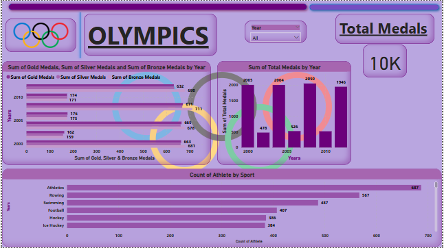
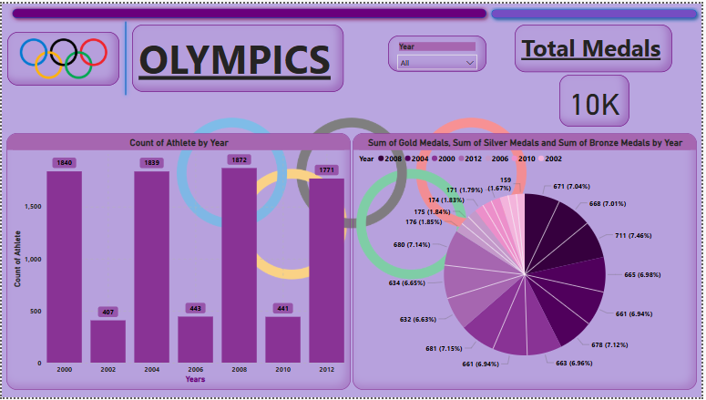
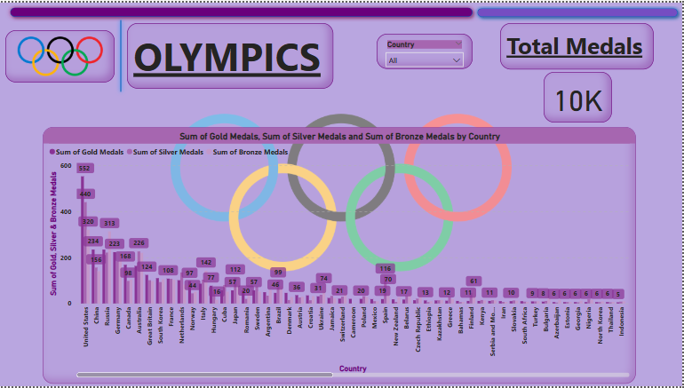
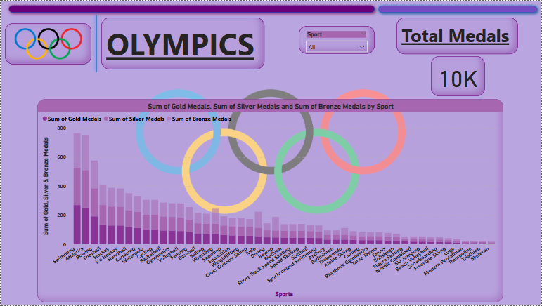
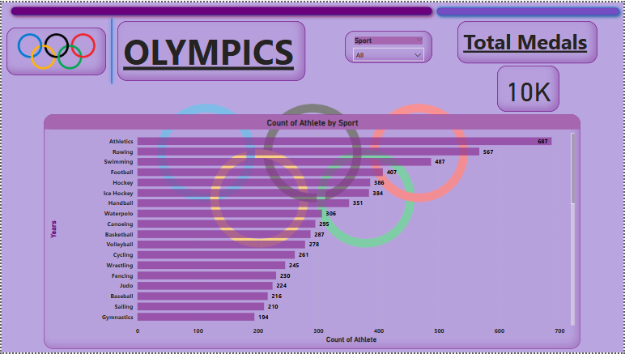

# 🏅 Olympics Power BI Dashboard

## 📌 Project Overview

The *Olympics Power BI Dashboard* is an interactive data visualization project built to analyze historical Olympic Games data. It reveals key insights into athlete performance, medal distribution, gender participation, and country-wise achievements across various Olympic editions.

The primary goal of this project is to demonstrate how raw sports data can be transformed into meaningful and actionable insights using business intelligence tools.

---

## 📂 Data Source

- Olympic-Athletes.xlsx: Contains athlete records, countries, events, medals, and Olympic year details.
- Data source is from a publicly available dataset on [Kaggle / official Olympic sources].

---

## 🔍 Key Insights & Features

- Total medal tally by country (Gold, Silver, Bronze, Total)
- Year-wise trends in participation and medal wins
- Top-performing athletes and sports categories
- Dynamic filtering by year, country, sport, and medal type

---

## 🛠️ Tools & Technologies Used

- Microsoft Power BI
- Microsoft Excel
- Power Query for data cleaning and transformation
- DAX (Data Analysis Expressions) for calculated measures

---

## 📁 Files Included

- Olympics Project.pbix: Power BI dashboard with interactive visuals and DAX measures
- Olympic-Athletes.xlsx: Dataset containing athlete and medal data
- README.md: Project overview and documentation

> ⚠️ Note: .pbix and .xlsx files are binary and cannot be previewed directly on GitHub. Please download them to open in Power BI or Excel.

---

## 🖼️ Dashboard Preview

Here are sample pages from the Olympics Power BI Dashboard:

### 📊 Page 1 

### 🌍 Page 2 

### 🏃 Page 3 

### ⚥ Page 4 

### 🎯 Page 5 

---

## 📬 Contact

Created by *Rohit Sawant*  
Feel free to connect for feedback, suggestions, or collaboration on future data projects.
